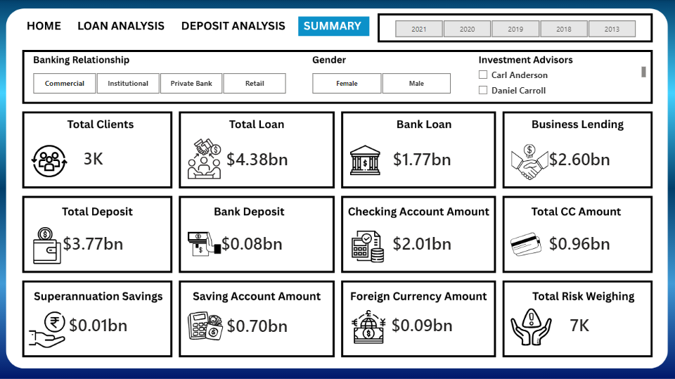

#  Banking Risk Analytics Dashboard using Power BI

## Project Overview

This project focuses on analyzing banking risk, customer financial behavior, and account performance using Power BI.

The dashboard provides meaningful insights into:

- Customer deposits and loans
- Credit card balances
- Banking relationship analysis
- Risk segmentation
- Customer income analysis
- Account balance monitoring
- Financial KPI tracking

The project helps understand how banks analyze customer risk and financial performance for better decision-making.

---

## Tools & Technologies Used

- Power BI
- Microsoft Excel
- Power Query
- DAX
- Data Visualization
- Data Cleaning & Transformation

---

## Dashboard Features

### KPI Cards
- Total Customers
- Total Deposits
- Total Loans
- Credit Card Balance
- Business Lending
- Savings & Checking Account Analysis

### Visualizations
- Risk Category Analysis
- Customer Income Distribution
- Gender Analysis
- Banking Relationship Analysis
- Loan vs Deposit Comparison
- Region/City-wise Analysis

### Interactive Features
- Slicers and Filters
- Drill-down Analysis
- Dynamic Charts
- Interactive Dashboard Navigation

---

## Dataset Information

The dataset contains banking customer information including:

- Customer demographics
- Account balances
- Loan details
- Credit card information
- Deposit amounts
- Banking relationship data
- Income and occupation details

---

## Key Insights

- Customers with higher income showed higher deposit balances.
- Credit card balances contributed significantly to banking risk.
- Business lending customers maintained larger account balances.
- Certain customer segments showed higher loan dependency.
- Savings accounts had higher contribution compared to checking accounts.

---

## Dashboard Screenshots

### Home Dashboard

### Loan Analysis

### Desposit Analysis

### Summary

---

## Project Learnings

Through this project, I learned:

- Data cleaning using Power Query
- Creating calculated measures using DAX
- Building interactive dashboards
- Banking domain KPI analysis
- Risk analytics concepts
- Business storytelling using visualizations

---

## Future Improvements

- Add real-time data integration
- Include predictive risk analysis
- Add machine learning based customer segmentation
- Improve mobile dashboard responsiveness

---

## Author

Divyaa Shri B
Aspiring Data Analyst

LinkedIn: https://www.linkedin.com/in/divyaa-shri-b-518513252/

GitHub: https://github.com/divya-0315/